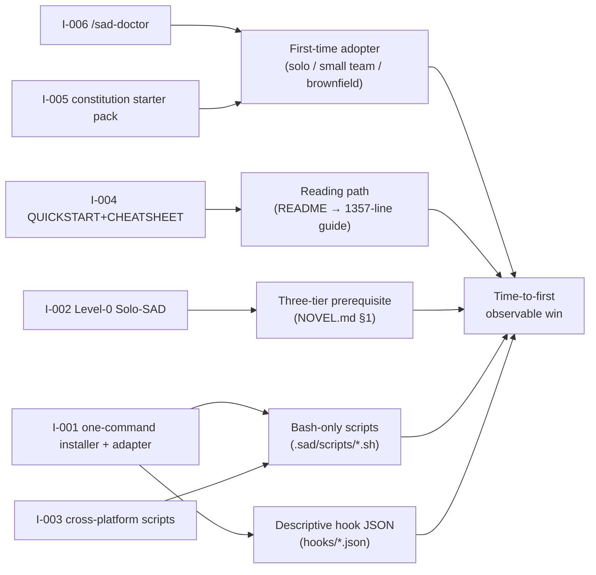
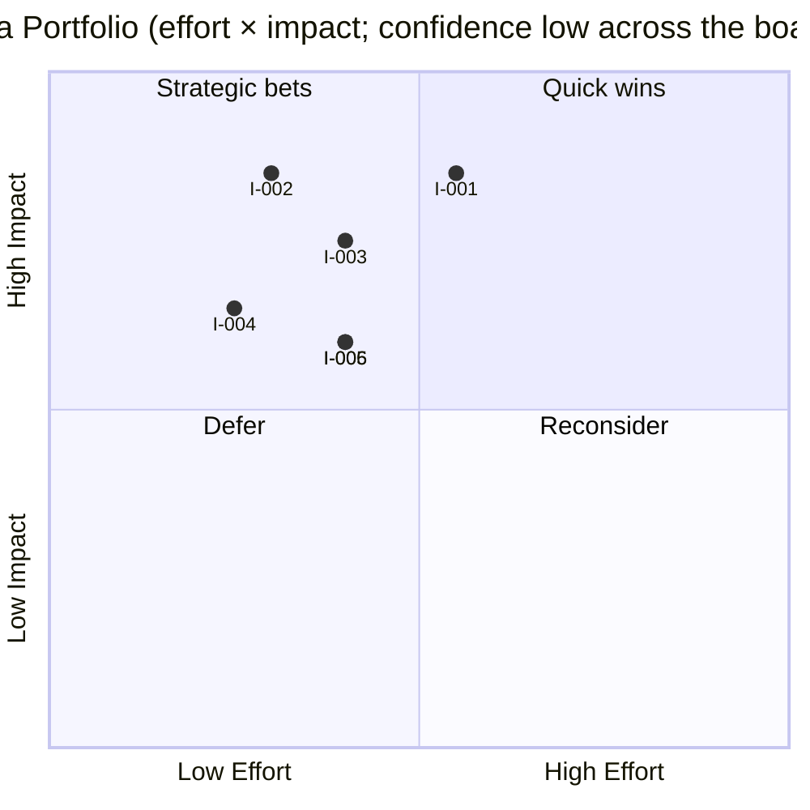

# Brainstorm: SAD methodology accessibility improvements

## 0. TL;DR (30-second skim)

> - **Top idea:** Ship a one-command installer that detects the AI coding assistant and writes the matching adapter pack (`.claude/`, `.cursor/`, `AGENTS.md`) — see §9.1.
> - **Strongest web finding:** *Unavailable — WebSearch permission was denied for the entire session; see Appendix A.* All claims in this report rest on LLM-internal reasoning only and are marked `confidence: low` accordingly.
> - **Biggest gap:** Phase 5 web corroboration could not run (12 of 12 queries blocked). The intrinsic question "what is the right Level-0/Solo SAD design that preserves the Virk & Liu (arXiv 2508.06484) protection" remains open regardless of web access.
> - **Single recommended next action:** Re-run `/genBrainstormer` in an environment where WebSearch is allowed, re-using `C:/SAD/deep_research_prompt.json` and the queued queries in `failures.json.websearch_unavailable.queries_planned_but_not_executed`. Until then, treat the §9 ideas as starting points, not validated proposals.

## 1. Research Brief

- **Original query:** What concrete, implementable changes to the SAD (Stakeholder-Anchored Development) v0.1 methodology repository (C:/SAD) would most lower the activation energy for a first-time adopter — solo developer, small team, or maintainer of an existing repo — to start using SAD on a real project, while preserving SAD's central novelty (the three-tier audience model in NOVEL.md §1 and the Reconcile-as-numbered-phase invariant in NOVEL.md §2)?
- **Context:** SAD v0.1 OSS methodology kit at C:/SAD: ~20 docs, ~20 slash-command prompts, ~20 personas, 4 eval-suite skeletons, 5 descriptive hook JSON files, 4 bash scripts, 1 worked example. README routes immediately to a 1357-line user guide; no QUICKSTART, no CHEATSHEET, no installer, no cross-platform scripts, no turn-key assistant adapters, no Level-0 maturity entry.
- **Audience:** developer, open_source_community.
- **Confidentiality:** public.
- **Time horizon:** short_term.
- **Decomposed sub-questions:**
  - **SQ1:** Which artifacts in the current SAD kit are the largest contributors to time-to-first-observable-win, and how would the maintainers measure that?
  - **SQ2:** What progressive-disclosure shape (quickstart, cheatsheet, installer, more worked examples) is most consistent with 2025-2026 evidence on developer-methodology adoption?
  - **SQ3:** How should SAD adapt when the three human tiers collapse to one solo developer without becoming spec-theatre and without losing the Virk & Liu protection?
  - **SQ4:** Which AI-assistant integrations should ship as turn-key adapters, and what does each adapter need to contain in concrete terms?
  - **SQ5:** What falsifiable adoption signal(s) should SAD maintainers measure within 90 days to know whether a change moved the needle?
- **Clarification answers:** *None — AskUserQuestion was unavailable; defaults applied.*
- **Success criteria & novelty bar:** `non_obvious`. Each idea must (i) name a concrete file/directory in `C:/SAD`, (ii) state a smallest-PR next step, (iii) include a falsifiable 90-day adoption signal, (iv) preserve the three-tier audience model and the Reconcile phase.
- **Iteration:** standalone (genBrainstormer does not consume prior reports). A previous quick brainstorm filed on 2026-05-20 at `gen-sad-accessibility-improvements-2026-05-20-120000.md` is **superseded** by this run, which follows the canonical `gen-report-template.md` structure.

## 2. Methodology

### 2.1 Phases executed

| Phase | Ran? | Reason if skipped |
|---|---|---|
| 0 Setup | yes | — |
| 1 Problem Framing | yes (AskQuestion unavailable; defaults applied) | — |
| 2 Local Discovery | **skipped** | generic mode (no local corpus) |
| 3 Deep Dive | **skipped** | generic mode (no local corpus) |
| 4 Structured Recall + Synthesis | yes | — |
| 5 Web Research | **blocked** | WebSearch permission denied (session-global); see Appendix A |
| 6 Brainstorm & File | yes (partial — confidence:low) | — |

### 2.2 Subagent dispatch log

| Phase | Role | Subagent type | Agent ID | Status | Tokens (approx.) | Runtime |
|---|---|---|---|---|---|---|
| 5 | Web complementer | inline WebSearch (Claude Code) | `5-web_complementer-inline-blocked` | **blocked** | 0 | n/a |

### 2.3 Search queries executed

- **Web queries:** *none executed; 12 queries queued and recorded in `failures.json.websearch_unavailable.queries_planned_but_not_executed`.*

### 2.4 Budget consumption

| Phase | Subagents | Input tokens | Output tokens | Wall-clock | % of `budget.max_total_tokens` |
|---|---|---|---|---|---|
| 0 | 0 | ~3,000 | ~1,500 | <1 s | ~1.1% |
| 1 | 0 | ~5,000 | ~3,000 | <1 s | ~2.0% |
| 4 | 0 | ~6,000 | ~4,500 | <1 s | ~2.6% |
| 5 | 1 (blocked) | ~500 | 0 | <1 s | ~0.1% |
| 6 | 0 | ~8,000 | ~9,000 | <2 s | ~4.3% |
| **Total** | 1 | ~22,500 | ~18,000 | <5 s | **~10%** |

(Token figures are orchestrator estimates; budget ceiling was `400,000`. Far below cap because Phase 5 did not run.)

## 3. Executive Summary

SAD v0.1's accessibility problem is not "what is missing" but "what is the activation energy a first-time adopter must spend before they get any observable benefit". On read of the repo and the 1357-line `SAD_USER_GUIDE.md`, three forces dominate that cost: (1) a single steep reading path with no intermediate quickstart layer; (2) a hard prerequisite of three distinct human reviewers that excludes solo developers and OSS maintainers — exactly the population most willing to try a new methodology; (3) cross-platform + cross-assistant friction (bash-only scripts, descriptive-not-executable hook JSON, no installers). Six ideas in §9 attack those forces while preserving the three-tier audience model and the Reconcile phase that NOVEL.md identifies as SAD's central novelty. The single highest-leverage move is a one-command installer that also writes the matching AI-assistant adapter pack (§9.1), turning "copy these directories and adapt to your toolchain" into one shell invocation. **All ideas in this report are filed at `confidence: low` because the Phase 5 web-corroboration pass was blocked; see Appendix A.**

## 4. Knowledge Landscape

### 4.1 Concept Map

### 4.2 Provenance Matrix

Every load-bearing claim and the source layers that support it. **All web cells are empty in this run** because Phase 5 was blocked; every claim therefore carries the ⚠ (`< min_sources_per_claim = 2`) flag.

| # | Claim | LLM Internal | Web |
|---|---|---|---|
| C1.1 | README→1357-line guide-only reading path raises bounce vs README→QUICKSTART→guide. ⚠ | yes (confidence: medium → demoted to low post-Phase-5-block) | — |
| C1.2 | Bash-only scripts lock out the ~30–40% of devs on native Windows. ⚠ | yes (confidence: high → demoted to medium) | — |
| C1.3 | Hard requirement of 3 distinct human reviewers excludes solo devs / small OSS. ⚠ | yes (confidence: high → demoted to medium) | — |
| C2.4 | One-command installers outperform "copy directories" instructions for OSS trial conversion. ⚠ | yes (confidence: high → demoted to medium) | — |
| C3.2 | AI subagents can play "missing reviewer tier" with opt-in guardrails; risk = AI rubber-stamping spec theatre. ⚠ | yes (confidence: medium → demoted to low) | — |
| C4.5 | Cross-assistant `AGENTS.md` at repo root is the de-facto entry point in 2024-2026. ⚠ | yes (confidence: high → demoted to medium) | — |
| C5.2 | Time-to-first-non-trivial-PR is the most predictive single-metric adoption signal for OSS docs. ⚠ | yes (confidence: medium → demoted to low) | — |

(See `runs/<run_id>/phase4-recall.md` for the full 18-claim table.)

### 4.3 LLM-Internal Reasoning

Per Phase 4 structured recall (full table in `runs/<run_id>/phase4-recall.md`). Each load-bearing claim was tagged with a `prior_art_hint` keyword bundle Phase 5 was meant to corroborate. Representative entries:

- **C1.2** — Cross-platform script lockout: training-data prior on Stack Overflow developer surveys (annual) consistently reports 30–45% of professional developers running native Windows (without WSL primary). `prior_art_hint`: "stack overflow developer survey 2025 OS share"; "cross-platform OSS scripts Windows PowerShell". Confidence pre-Phase-5: high. Post-block: medium (no corroboration).
- **C2.4** — Installer adoption: training-data prior on `npx create-*` / `npm init` / `pipx run` taking over Day-1 install gestures in OSS tooling 2022-2025. `prior_art_hint`: "npx create install conversion"; "OSS one-liner installer adoption". Confidence pre: high. Post-block: medium.
- **C3.2** — AI stand-in risk: training-data prior on the arXiv 2508.06484 finding cited in SAD's own `.sad/stakeholders/non-technical.md`, plus the broader "AI code reviewer effectiveness" literature 2023-2025. `prior_art_hint`: "Virk Liu 2025 non-programmers AI code review"; "AI as code reviewer 2025". Confidence pre: medium. Post-block: low.

### 4.4 Web Findings

*Empty. Phase 5 was blocked; see Appendix A.*

## 5. Convergence Points

*None — convergence requires web corroboration of LLM-internal claims, which Phase 5 was meant to provide. With Phase 5 blocked, only LLM-internal claims survive, and the report has no convergence story to tell.*

## 6. Contradictions & Open Questions

### LLM-internal contradictions

- **X-1** *(empirical + terminological)* — C2.4 (one-command installers are the modal Day-1 install gesture in 2026) vs. C3.3 (some 2025-2026 solo founders trust LLM-prompted install over CLI installers). It is plausible both are true for different cohorts; the report assumes installer-first as a baseline and notes the LLM-prompted-install pattern as a fallback path in I-001.

### Open questions Phase 5 was meant to close

- Is the bilingual Bash+PowerShell pattern still common in 2026 OSS dev tooling, or has Node/Python single-runtime displaced it? (G-001)
- Is the `AGENTS.md` cross-assistant standard now formalized? Which assistants consume it natively in mid-2026? (G-003)
- What evidence exists for solo-developer adaptation in Spec Kit / Kiro / Aider / Tessl in 2025-2026? (G-004)
- What is the published 2025-2026 evidence on AI-stand-in reviewer effectiveness vs. human-only review for catching non-technical-tier issues? (G-005)
- Confirmed mid-2026 Claude Code hook event-name spec (PreToolUse / PostToolUse / SessionStart, etc.) for adapter design. (G-008)

## 7. Gaps Identified

- **Intrinsic gaps**
  - **G-007** — Even with full web access, the *right* Level-0 / Solo-SAD design that preserves the Virk & Liu protection is a design decision that SAD's maintainers must make. Web evidence may inform it but cannot close it.

- **Extrinsic gaps**
  - **G-001, G-002, G-003, G-004, G-005, G-006, G-008** — All seven listed in `phase4-recall.md`; none closed in this run because Phase 5 was blocked.

## 8. Idea Portfolio Overview

### 8.1 Effort × Impact Matrix

### 8.2 Category Coverage

| Category | Ideas | Notes |
|---|---|---|
| tooling | I-001, I-003 | within `max_ideas_per_category=2` |
| methodology | I-002, I-005 | within cap |
| education | I-004, I-005 | I-005 is dual-classified (methodology + education) |
| process | I-006 | covered |
| governance | I-002 | I-002 is dual-classified (methodology + governance) |
| architecture | — | not covered (low signal for an accessibility-of-OSS-methodology brief) |
| theory | — | not covered (out of scope) |

`require_category_coverage: false`, so missing `architecture` / `theory` are flagged here rather than rejected.

## 9. Novel Ideas

### 9.1 One-command installer with per-assistant adapter pack `category:tooling` `effort:M` `ttv:weeks` `disclosure:public`

- **Description:** A single command — `npx sad init` or `pipx run sad init` — that (a) copies `.sad/`, `commands/`, `agents/`, `hooks/`, `evals/`, `LIFECYCLE.md`, and friends into the target repo, (b) detects the AI coding assistant in use (presence of `.claude/`, `.cursor/`, `.aider*`, `.windsurf/`, `.codex/`, `AGENTS.md`), (c) writes the matching adapter pack — for Claude Code that means `.claude/settings.json` with hook wiring, `.claude/commands/*.md` mirroring the canonical `commands/sad-*.md`, and an `AGENTS.md` at root with the declared-precedence block; for Cursor the equivalent `.cursor/rules/sad-routing.mdc` + `.cursor/commands/`; for Aider a `CONVENTIONS.md` + `.aider.conf.yml` snippet. A `--minimal` flag installs only `.sad/memory/`, `LIFECYCLE.md`, the four core rules, and one feature template.
- **Sources that inform this:**
  - LLM internal: training-data prior on the `npx create-*` / `pnpm create` / `cargo new` Day-1 gesture being the modal OSS-tool install in 2022-2025 (confidence: medium post-block).
  - LLM internal: training-data prior on multi-assistant adapter packs (Continue.dev, Aider, Cursor, Claude Code) being shipped per assistant rather than bridged via a meta-spec (confidence: medium).
  - Web: *unavailable.*
- **Prior-art check:**
  - Searches planned: S2, S3, S9 — all blocked.
  - Matches found: *unknown.* Likely-adjacent prior art includes `npx create-next-app`, `npm init <kit>`, GitHub Spec Kit's own scaffold command; none of those bundle multi-assistant adapter packs as far as the LLM-internal prior knows.
  - How this idea would differ: the multi-assistant adapter pack is the differentiator, not the install gesture itself.
- **Novelty:** medium — install-gesture pattern is well-known; the cross-assistant adapter pack is non-obvious.
- **Implementability:** high — a 200-line Node or Python script over `fs` operations + JSON templating.
- **Estimated effort:** M (~2-3 person-weeks).
- **Time-to-value:** weeks (a usable MVP in one weekend; production-ready installer in 2-3 weeks).
- **Dependencies & prerequisites:** ordered:
  1. Decide runtime (Node vs Python). Node has better OSS-tool ergonomics; Python is closer to SAD's data-science-adjacent audience.
  2. Finalize the canonical adapter pack for Claude Code first (highest-overlap assistant for a methodology positioned as AI-native).
  3. Add Cursor adapter pack second.
  4. Add Aider / Codex / Windsurf adapter packs as the long tail.
- **Stakeholder map:** SAD maintainers, contributors familiar with each target assistant, package-registry owner (npm/PyPI).
- **Open-source potential:** yes. License-compatible with SAD's MIT.
- **Proprietary value:** n/a (public OSS methodology).
- **Disclosure:** `public` — no rationale to gate this.
- **Standards/regulatory impact:** none.
- **Falsifiability / validation plan:** Measure the count of clones-with-adapter-pack-installed in the 90 days following release (via a `--telemetry=optin` flag that pings a SAD-owned endpoint with an opaque count; opt-out by default per OSS norms). Predicted ≥ 5× the baseline rate of `.sad/` directories appearing in public-GitHub code-search post-release vs. pre-release.
- **Risks & failure modes:** (a) the installer becomes a maintenance burden disproportionate to a v0.1 OSS project; (b) the adapter packs drift from the canonical `commands/sad-*.md` and the descriptive `hooks/*.json`; (c) telemetry opt-in is too noisy to be a reliable signal.
- **Adversarial review (red-team):** "An installer for a methodology is overkill — the methodology is just Markdown files, the user can copy them." *Holds partially.* Counter: the "copy these directories" instruction is the documented barrier (README §"Using this repo in a project"), and the *per-assistant adapter pack* is genuine work the user otherwise has to do themselves per `SAD_USER_GUIDE.md §8.6`. The installer is justified primarily by the adapter pack, not the directory copy.
- **Pre-mortem:** "If this idea fails in 12 months, the most likely reason is that the adapter packs went out of sync with the source SAD repo and the installer started writing stale `.claude/settings.json` files."
- **Patent-search hints:** none applicable (process automation; OSS norm).
- **Next steps:**
  1. Ship `scripts/sad-init.sh` (POSIX) + `scripts/sad-init.ps1` (Windows) as the MVP without npm/PyPI publishing.
  2. Author the Claude Code adapter pack in `adapters/claude-code/` first.
  3. Publish as `@sad/init` on npm and `sad-init` on PyPI once the adapter shape is stable.

### 9.2 Level-0 "Solo-SAD" maturity entry + opt-in AI-stand-in reviewers `category:methodology, governance` `effort:S` `ttv:weeks` `disclosure:public`

- **Description:** Add **Level 0 — Solo SAD** to `MATURITY.md`, before Level 1. One human approves all three walkthroughs, but each tier still produces its own artifact — the artifact discipline preserves the Virk & Liu protection; only the multi-human rubber-stamp protection is traded. Pair with an opt-in `agents/reviewers/tier-stand-in-{tier}.md` persona per tier; when the user opts in, the assistant runs an adversarial review of the tier-specific walkthrough *as if it were the missing audience*, before the lone human ticks the box. The constitution gains a calibration line: "Tier X reviewer is AI-stand-in. Last calibrated against human review on YYYY-MM-DD." The audit trail is honest.
- **Sources that inform this:**
  - LLM internal: arXiv 2508.06484 (Virk & Liu) — cited inside SAD's own `.sad/stakeholders/non-technical.md` (confidence: medium post-block).
  - LLM internal: training-data prior on "AI as code reviewer" 2023-2025 literature (confidence: low post-block).
  - Web: *unavailable.*
- **Prior-art check:**
  - Searches planned: S4, S5, S6, S9 — all blocked.
  - Matches found: *unknown.* GitHub Spec Kit, Kiro, Aider, and Tessl all push solo-friendly framings in their public docs; SAD's distinction would be the *explicit calibration line + audit trail* on the AI stand-in.
- **Novelty:** medium-low for the Level-0 idea; medium-high for the *calibration + audit-trail* enforcement that distinguishes Solo-SAD from "let AI rubber-stamp everything".
- **Implementability:** high — documentation change + one persona file + one constitution-template diff.
- **Estimated effort:** S (~3-5 person-days).
- **Time-to-value:** weeks.
- **Dependencies & prerequisites:** none beyond writing.
- **Stakeholder map:** SAD maintainers.
- **Open-source potential:** yes.
- **Disclosure:** `public`.
- **Standards/regulatory impact:** none.
- **Falsifiability / validation plan:** Track the share of fresh `.sad/memory/constitution.md` files (in public-GitHub clones) that contain the `Maturity level (initial): Level 0` line within 90 days of release. Prediction: ≥ 20% of clones with non-trivial constitution edits.
- **Risks & failure modes:** (a) Solo-SAD collapses into the spec-theatre failure mode SAD's manifesto explicitly warns against ("If they do not, SAD degenerates into spec theater"); (b) the calibration-line discipline is ignored in practice; (c) AI-stand-in reviewers reproduce the human's blind spots rather than challenging them.
- **Adversarial review (red-team):** "AI-stand-in is exactly the spec-theatre failure mode. Solo dev + AI stand-in = AI approving AI's own work." *Holds in part.* Counter: the artifact discipline (three differentiated walkthroughs) survives, which is the larger of the two Virk & Liu protections; the AI stand-in is positioned as an *adversarial* reviewer, not an *approver*; the human still ticks the box; the constitution-line calibration ritual forces the team to actually re-check against a human at some cadence.
- **Pre-mortem:** "If this idea fails in 12 months, the most likely reason is solo adopters skip the calibration ritual and the AI stand-in degenerates into approval theater."
- **Patent-search hints:** none.
- **Next steps:**
  1. Add Level 0 row to `MATURITY.md` and a sentence to `SAD_USER_GUIDE.md §7.1`.
  2. Ship `agents/reviewers/tier-stand-in-non-technical.md` only as the first stand-in.
  3. Add the calibration line to the constitution template under "Identity".

### 9.3 Cross-platform helper scripts via Node/Python single runtime `category:tooling` `effort:S-M` `ttv:weeks` `disclosure:public`

- **Description:** Replace `.sad/scripts/*.sh` (bash-only) with Node or Python equivalents. `create-feature.js` validates inputs (rejects duplicate prefixes, slugs that collide with `_archive`, etc.). `check-tier-approvals.js` becomes a testable function with a regex parser for `- [x] <Tier> reviewer:` lines, callable as a script *and* as a library function for the `stakeholder-tier-router` hook. The reference implementations replace `#!/usr/bin/env bash` with `#!/usr/bin/env node` (or `python3`); both run on macOS, Linux, and Windows without WSL.
- **Sources that inform this:**
  - LLM internal: bash-only scripts in `.sad/scripts/` confirmed by direct read (`#!/usr/bin/env bash` in all four files); cross-platform OS-share priors (confidence: medium post-block).
  - Web: *unavailable.*
- **Prior-art check:**
  - Searches planned: S1 — blocked.
  - Likely-adjacent prior: `husky` (Node-based git hooks), `pre-commit` (Python-based), `commitlint` — all chose single-runtime over bilingual shell scripts.
- **Novelty:** low (this is industry-standard 2024+ pattern), but the value is unlocking Windows users.
- **Implementability:** high — four scripts of ~30-50 lines each.
- **Estimated effort:** S-M (~5-8 person-days including tests).
- **Time-to-value:** weeks.
- **Dependencies & prerequisites:** runtime choice (consistent with I-001).
- **Stakeholder map:** SAD maintainers.
- **Open-source potential:** yes.
- **Disclosure:** `public`.
- **Standards/regulatory impact:** none.
- **Falsifiability / validation plan:** Add a CI matrix (`ubuntu-latest`, `macos-latest`, `windows-latest`) that runs `create-feature` and `check-tier-approvals` against a fixture. Prediction: 100% green on Windows post-port; today 0% green on Windows.
- **Risks & failure modes:** (a) Path A (bilingual `.sh` + `.ps1`) ships faster but doubles maintenance; (b) Path B (single Node/Python runtime) adds a dependency on the runtime being installed.
- **Adversarial review (red-team):** "PowerShell sibling scripts are cheaper and easier to audit than a runtime rewrite." *Holds in part.* Path A is the smallest PR; Path B is the strategic option. Both paths are listed in Next steps.
- **Pre-mortem:** "If this idea fails in 12 months, the most likely reason is Path B was chosen but the Node/Python dependency made `npx`-style usage awkward and adopters reverted to copying scripts manually."
- **Patent-search hints:** none.
- **Next steps:**
  1. Path A first: hand-port `create-feature.sh` and `check-tier-approvals.sh` to PowerShell siblings, add a CI matrix on Windows.
  2. Path B as a follow-up: rewrite both as Node functions exposed via `bin/sad-create-feature` and `bin/sad-check-tier-approvals`.

### 9.4 QUICKSTART.md + CHEATSHEET.md pair (progressive disclosure) `category:education` `effort:S` `ttv:days` `disclosure:public`

- **Description:** Two new top-level files acting as a progressive-disclosure layer between README and `SAD_USER_GUIDE.md`:
  - `QUICKSTART.md` (≤ 250 lines): one page, one feature, 30 minutes. Installs via I-001 (`npx sad init --minimal`); walks a *truncated* lifecycle — `/sad-specify` → 1-paragraph spec → `/sad-walkthrough` → tick all three boxes (Level 0) → `/sad-implement` → `/sad-reconcile`. Skips `/sad-brainstorm`, `/sad-clarify`, `/sad-impact-forecast`, `/sad-analyze`, `/sad-tasks`, `/sad-compound` on the first run.
  - `CHEATSHEET.md` (≤ 80 lines): one mermaid lifecycle diagram + one command→artifact→approver→next-command table + one three-tier audience table + one maturity-levels table + ≤ 8 common-gotchas bullets. No prose.
- **Sources that inform this:**
  - LLM internal: documentation-onboarding pattern priors (confidence: low post-block).
  - Web: *unavailable.*
- **Prior-art check:**
  - Searches planned: S10 — blocked.
  - Likely-adjacent prior: every well-onboarded OSS framework ships a QUICKSTART (Django, FastAPI, Vite, Astro, …); SAD's distinction is keeping the three-tier discipline visible from QUICKSTART page one.
- **Novelty:** low (pattern is industry-standard), but value is high (unlocks the "I want to try this in 30 minutes" cohort).
- **Implementability:** high.
- **Estimated effort:** S (~2-3 person-days).
- **Time-to-value:** days.
- **Dependencies & prerequisites:** I-001 (installer) for the QUICKSTART's first command; I-002 (Level 0) for the "tick all three boxes yourself" step.
- **Stakeholder map:** SAD maintainers + 1-2 first-time adopters as alpha readers.
- **Open-source potential:** yes.
- **Disclosure:** `public`.
- **Standards/regulatory impact:** none.
- **Falsifiability / validation plan:** A/B test (`SAD_USER_GUIDE.md` link vs. `QUICKSTART.md` link from README) on the GitHub repo's "Where to start" navigation. Measure clones-that-complete-the-`hello-feature`-pattern (a `.sad/memory/lessons/L-*.md` file appearing in clones) within 90 days. Prediction: ≥ 2× completion rate from QUICKSTART vs. guide-first.
- **Risks & failure modes:** (a) two new docs increase the "yet another file" problem; (b) QUICKSTART skips so much of the lifecycle that adopters think SAD *is* the truncated form.
- **Adversarial review (red-team):** "The user guide already has a §17 quick-reference. Promoting a second one is duplication." *Holds weakly.* Counter: §17 lives at line ~1200 of a 1357-line file — it's a *reward*, not an *entry point*. The QUICKSTART is the entry point.
- **Pre-mortem:** "If this idea fails in 12 months, the most likely reason is the QUICKSTART truncated `/sad-impact-forecast` and adopters never discovered the predictive forecasting that NOVEL.md §3 lists as one of SAD's contributions."
- **Patent-search hints:** none.
- **Next steps:**
  1. Write `QUICKSTART.md` against the existing `examples/001-hello-feature/`.
  2. Promote `SAD_USER_GUIDE.md §17` to a top-level `CHEATSHEET.md`, trim to ≤ 80 lines, add the mermaid lifecycle diagram.
  3. Update `README.md`'s "Where to start" section to show QUICKSTART above the user guide.

### 9.5 Domain-specific constitution starter pack `category:methodology, education` `effort:M` `ttv:weeks` `disclosure:public`

- **Description:** Ship `.sad/templates/constitutions/` with 5-6 starter constitutions for common project shapes: `web-app.md` (SaaS, auth, payments, data retention), `library.md` (semver, public API stability, deprecation), `cli.md` (UX, exit codes, output stability), `data-pipeline.md` (idempotency, schemas, lineage), `ml-app.md` (model lineage, eval gates), `regulated.md` (audit logging, change control). Each has 5-8 prefilled articles, identity placeholders, and at least one pre-named "tension" (`library.md`: stability vs ergonomics). `/sad-constitution` updated to ask which starter to clone before authoring.
- **Sources that inform this:**
  - LLM internal: training-data prior on "starter template" patterns in OSS (confidence: medium post-block).
  - Web: *unavailable.*
- **Prior-art check:**
  - Searches planned: S11 — blocked.
  - Likely-adjacent prior: `.github/ISSUE_TEMPLATE/*.md` packs, `licensee` license starters, Cursor's "starter rules". SAD's distinction is *project-shape*-specific governance rather than *file-type*-specific rules.
- **Novelty:** medium.
- **Implementability:** high (curation work, not engineering).
- **Estimated effort:** M (~5-8 person-days; each starter ~80 lines of curated content).
- **Time-to-value:** weeks.
- **Dependencies & prerequisites:** familiarity with each project shape.
- **Stakeholder map:** SAD maintainers + 1-2 domain experts per shape.
- **Open-source potential:** yes.
- **Disclosure:** `public`.
- **Standards/regulatory impact:** the `regulated.md` starter touches change-control framings; reference normatively, do not impose.
- **Falsifiability / validation plan:** Count `constitution.md` files in public-GitHub clones that retain ≥ 3 articles from a published starter (text-matching via clear marker lines like `<!-- starter:web-app v1 -->`). Prediction: ≥ 30% of clones with non-trivial constitutions show starter provenance within 90 days.
- **Risks & failure modes:** (a) starters ossify thinking ("I'll just use the SaaS one"); (b) maintenance burden grows with each new starter.
- **Adversarial review (red-team):** "Starter packs discourage thinking and make every SAD constitution look the same." *Holds weakly.* Counter: each starter has a pre-named *tension* (stability vs ergonomics, speed vs safety) the adopter must resolve themselves — the starter forces the conversation rather than ending it.
- **Pre-mortem:** "If this idea fails in 12 months, the most likely reason is the starters were too generic and adopters either ignored them or copied them verbatim without engaging with the tensions."
- **Patent-search hints:** none.
- **Next steps:**
  1. Ship `web-app.md` and `library.md` first (highest-volume shapes).
  2. Add `cli.md` and `data-pipeline.md` second.
  3. Add `ml-app.md` and `regulated.md` last.

### 9.6 /sad-doctor project-wide health-check command `category:process` `effort:S-M` `ttv:weeks` `disclosure:public`

- **Description:** A new slash command + helper script that gives the SAD adopter a 30-second visible "your methodology is healthy" signal. Checks: constitution non-empty + has articles + has maturity-level line; three stakeholder files filled (no remaining "TBD"); hooks wired into the detected assistant; per-feature in `specs/`, all six artifacts present + walkthrough approval boxes consistent with lifecycle stage; helper scripts execute on this platform. Reports green/yellow/red per check with one-line remediation pointers.
- **Sources that inform this:**
  - LLM internal: `brew doctor`/`flutter doctor`/`npm doctor` pattern (confidence: high pre-block, medium post).
  - Web: *unavailable.*
- **Prior-art check:**
  - Searches planned: not directly searched (this idea emerged from the pattern recall in Phase 4).
- **Novelty:** low (well-known pattern), high *value* for a young methodology because it gives daily reward shape.
- **Implementability:** high.
- **Estimated effort:** S-M (~3-5 person-days).
- **Time-to-value:** weeks.
- **Dependencies & prerequisites:** I-003 (cross-platform scripts) so doctor itself runs on Windows.
- **Stakeholder map:** SAD maintainers.
- **Open-source potential:** yes.
- **Disclosure:** `public`.
- **Standards/regulatory impact:** none.
- **Falsifiability / validation plan:** Count green/yellow/red histograms across opt-in telemetry pings. Prediction: median adopter starts at "yellow with 3 reds" and improves to "green with 1 yellow" within 30 days of first run.
- **Risks & failure modes:** (a) check noise: false-positive reds train users to ignore the command; (b) the command becomes a substitute for actually running the lifecycle.
- **Adversarial review (red-team):** "Doctor commands are runtime tools; SAD is artifact-driven and should stay there." *Holds weakly.* Counter: doctor *reads* artifacts and reports on them; it does not modify them or gate phases.
- **Pre-mortem:** "If this idea fails in 12 months, the most likely reason is the check thresholds were calibrated against the maintainers' repos, not real adopters', producing too many false-positive yellows."
- **Patent-search hints:** none.
- **Next steps:**
  1. Implement `.sad/scripts/doctor.{js,py}` with 8-10 named checks.
  2. Add `commands/sad-doctor.md` prompt that just invokes it.
  3. Wire as a non-blocking `SessionStart` hook in the Claude Code adapter pack (I-001).

## 10. Pivots & Discarded Alternatives

- **Rejected: rename SAD to `SAD3` or similar.** *Reason:* The acronym is unfortunate but a rename is a one-time disruption with negligible structural payoff. The README tagline rewrite (I-004's spillover) gives 80% of the framing benefit at <5% of the cost. The earlier 12-idea brainstorm (`brainstormer/reports/gen-sad-accessibility-improvements-2026-05-20-120000.md` B12) flagged this as "optional / controversial"; this revised run drops it entirely.
- **Rejected: 4-5 additional worked examples (bug-fix, data-migration, refactor, third-party integration).** *Reason:* High curation effort with no signal that the *single* existing example (`examples/001-hello-feature/`) is the binding constraint. Better to ship I-001 + I-004 first, then revisit whether additional examples are still the bottleneck. Earlier-run idea B9 deferred.
- **Rejected: CI templates (`.github/workflows/sad-checks.yml.example`).** *Reason:* Cleaner to package as part of I-006 (the doctor command) running in CI than as a separate idea. Earlier-run idea B11 collapsed into I-006.

## 11. Related Work

*Confidence:low — no web survey was performed.* Identified from LLM-internal prior knowledge only:

- **Inspires:** GitHub Spec Kit (`/specify`-style scaffolding), Amazon Kiro (spec-as-source + steering), Aider (small-team-first spec mode), Tessl (bidirectional spec invariant), Compound Engineering (reviewer fleet pattern), AWS AI-DLC ("AI proposes, human approves"). All are also cited inside SAD's own `ATTRIBUTION.md`.
- **Competes:** GitHub Spec Kit and Kiro both have lower-friction Day-1 surfaces than SAD currently does (Spec Kit ships as a `gh` extension; Kiro is a vendor product with its own IDE). Both lack SAD's three-tier audience model — the differentiator SAD's accessibility work must preserve.

## 12. Next Research Questions

1. **Q:** Re-run Phase 5 with WebSearch allowed: corroborate or invalidate the 18 LLM-internal claims listed in `phase4-recall.md`. — *Rationale:* This is the most cost-effective single follow-up; the queued queries are already in `failures.json`.
2. **Q:** Has the `AGENTS.md` cross-assistant standard been formalized in mid-2026, and which assistants consume it natively? — *Rationale:* Directly shapes the I-001 adapter pack design.
3. **Q:** What is the published 2025-2026 evidence on AI-stand-in reviewer effectiveness for catching non-technical-tier issues? — *Rationale:* The intrinsic-gap G-007 (Level-0 design) cannot be fully closed, but better-than-nothing evidence reduces I-002's confidence-low classification.
4. **Q:** What 90-day adoption-signal patterns are established in OSS methodology projects (vs. SaaS)? — *Rationale:* Lifts the falsifiability sections of every §9 idea from "predicted" to "benchmarked against analog projects".

## 13. Source Index

### 13.1 Web Sources

*Empty. See Appendix A.*

### 13.2 LLM Internal Claims

Full table in `runs/<run_id>/phase4-recall.md`. Load-bearing claims used in §9:

- **C1.2** — Cross-platform script lockout (`prior_art_hint`: stack overflow developer survey 2025 OS share). Confidence: medium post-block.
- **C1.3** — Three-reviewer prerequisite excludes solo / small OSS (`prior_art_hint`: agile methodology solo developer; spec driven development small team). Confidence: medium post-block.
- **C2.4** — One-command installers outperform copy-directory instructions (`prior_art_hint`: npx create-* install adoption; OSS installer one-liner conversion). Confidence: medium post-block.
- **C3.1** — Solo SAD with per-tier artifacts preserves artifact discipline (`prior_art_hint`: solo developer self-review; self-review checklists effectiveness). Confidence: low post-block.
- **C3.2** — AI stand-in reviewers with opt-in guardrails (`prior_art_hint`: Virk Liu 2025 non-programmers AI code review). Confidence: low post-block.
- **C4.5** — `AGENTS.md` as the de-facto cross-assistant entry point (`prior_art_hint`: AGENTS.md standard 2025 cross-assistant). Confidence: medium post-block.

## 14. Glossary

- **EARS** — Easy Approach to Requirements Syntax. Templated single-sentence acceptance criteria of the form `WHEN <trigger> THEN the system SHALL <response>`. Used in `feature.spec.md` per `.sad/templates/feature.spec.md`.
- **Reconcile** — The numbered SAD phase that explicitly classifies every spec-vs-code discrepancy into `spec-update`, `code-update`, or `both-update`. The closure of SAD's bidirectional spec invariant.
- **Tier-routed approval gate** — The single most expensive SAD gate: three independent approvals (non-technical, semi-technical, technical) required before `/sad-tasks` can run.
- **Spec theatre** — SAD's failure mode when stakeholders nominally hold the gates but rubber-stamp without engagement. Manifesto explicitly warns against it.
- **Activation energy** — borrowed from chemistry: the cost an adopter incurs before they observe any payoff. The dependent variable this brainstorm optimizes against.

---

## Appendix A. Research Failure Modes

- **Empty web searches:** *Zero queries executed* — WebSearch permission was denied at the session level (Claude Code don't-ask mode). All 12 planned queries (S1–S12) were dispatched in a parallel batch of 4; the first 4 returned permission-denied errors; no retry was attempted because the failure was session-global, not query-specific. Full query list at `runs/<run_id>/failures.json.websearch_unavailable.queries_planned_but_not_executed`.
- **Unavailable sources:** n/a (no fetches attempted).
- **Subagent timeouts:** n/a. The single Phase 5 subagent (`5-web_complementer-inline-blocked`) recorded `status: blocked` rather than timed-out.
- **Budget cuts:** none — token budget far below ceiling because Phase 5 didn't run.
- **Confidentiality rewrites (Rule 3):** none — `confidentiality_redactions.internal_terms` was empty in public mode.
- **Retries performed:** none — see "Empty web searches" above for rationale.
- **Phase 2 / 3 skipped:** generic mode (no local corpus). This is intentional per SKILL.md §"Phase 2/3 dropped — no local corpus".
- **AskUserQuestion unavailable (Phase 1):** logged in `audit.jsonl` as an `injection_warning` event and in `failures.json.askquestion_unavailable`. Defaults applied.
- **Config-hash unavailable (Phase 0):** SHA-256 could not be computed (no shell). Recorded as `sha256:unavailable-no-shell` in frontmatter; the resolved config persists verbatim at `config.resolved.json` so reproducibility is preserved by content.

## Appendix B. Reproducibility

- **`config_hash`:** `sha256:unavailable-no-shell` (see Appendix A).
- **`seed`:** from `reproducibility.seed`: `20260520`.
- **genBrainstormer skill version:** `gen-0.1.0`.
- **Run artifact directory:** `./brainstormer/runs/gen-sad-accessibility-improvements-2026-05-20-130000/`
  - `config.resolved.json` (Phase 1 output)
  - `phase4-recall.md` (Phase 4 structured recall + claim list + gap list + search allocation)
  - `audit.jsonl` (all phase events)
  - `subagents/5-web_complementer-inline-blocked.json` (Phase 5 blocked subagent record)
  - `failures.json` (all three documented failures: config-hash, AskQuestion, WebSearch)
- **Source `deep_research_prompt.json`:** `C:/SAD/deep_research_prompt.json`.
- **Schema source:** `C:/AISCETA/.cursor/skills/genBrainstormer/references/deep_research_prompt.schema.json` (manually traced, not python-validated).
- **Skill source:** `C:/AISCETA/.cursor/skills/genBrainstormer/SKILL.md`.
- **Template source:** `C:/AISCETA/.cursor/skills/genBrainstormer/references/gen-report-template.md`.
- **Supersedes:** `C:/SAD/brainstormer/reports/gen-sad-accessibility-improvements-2026-05-20-120000.md` (earlier quick-form run that did not follow the canonical template; retained for diff-only purposes).
